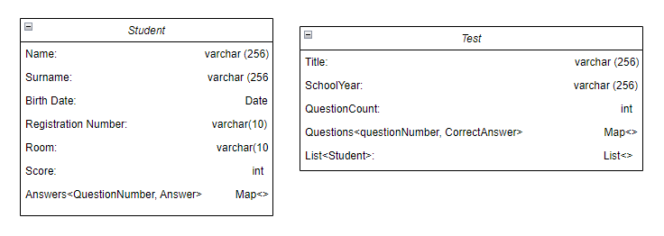

# ScanEvalApp (Testovane vo wsl debian win 11)

Dokumentácia dostupná [TU](https://docs.google.com/document/d/1oPEVyG-Ius-a9JKvhcH9mh4ZzbzJkZ4PRGxit0UCV0w/edit?usp=sharing)

### Install dependencies
- nainstaluje dependecy na kompilaciu latex sablony (treba spravit `chmod +x installDependencies.sh`)
- nainstaluje aj golang verziu 1.23.2 (ked to budete spustat druhy a viac krat tak dajte -f aby vam znova nepridavalo cestu do .bashrc)

### Build a spustenie
`go build -o main` \
`./main`

### Class Diagram

### Install OCR
`sudo apt-get install tesseract-ocr tesseract-ocr-slk`
### Run OCR
`tesseract assets/tmp/scan-images/auto-scan-multiple-pages-image-00000.jpg out --psm 3 -l slk`

### Install openCV and goCV
`sudo apt update && sudo apt install g++ wget unzip build-essential cmake git pkg-config libgtk-3-dev libavcodec-dev libavformat-dev libswscale-dev libv4l-dev libxvidcore-dev libx264-dev libjpeg-dev libpng-dev libtiff-dev gfortran openexr libatlas-base-dev python3-dev python3-numpy libtbbmalloc2 libtbb-dev`
#### Opencv4 installation
`cd /tmp && wget -O opencv.zip https://github.com/opencv/opencv/archive/4.10.0.zip`
`unzip opencv.zip`
`mkdir -p build && cd build`
`cmake  ../opencv-4.10.0`
`cmake --build .`
#### gocv installation
`cd /usr/local/go/src && sudo git clone https://github.com/OndrejKocak/gocv.git`
`cd gocv && make install`

#### Verify goCV installation
`go run ./cmd/version/main.go`
##### Expected output:
`gocv version: 0.38.0` \
`opencv lib version: 4.10.0`
