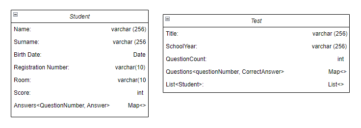

# ScanEvalApp (Testovane vo wsl debian)

Dokumentácia dostupná [TU](https://docs.google.com/document/d/1oPEVyG-Ius-a9JKvhcH9mh4ZzbzJkZ4PRGxit0UCV0w/edit?usp=sharing)

### Install dependencies
- nainstaluje dependecy na kompilaciu latex sablony (treba spravit `chmod +x installDependencies.sh`)
- nainstaluje aj golang verziu 1.23.2 (ked to budete spustat druhy a viac krat tak dajte -f aby vam znova nepridavalo cestu do .bashrc)

### Build a spustenie
`go build -o main` \
`./main`

### Class Diagram

